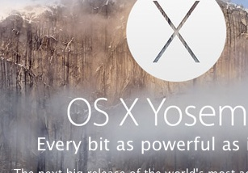

**Notebooks rendered in nbviewer:** <http://nbviewer.ipython.org/github/sr320/fish546-2015/tree/master/notebooks/>


Image test




```
!blastx \
-query {fa} \
-db {db} \
-max_target_seqs 1 \
-max_hsps 1 \
-outfmt 6 \
-evalue 1E-05 \
-num_threads 6 \
-out ../analyses/{sp}_sprot.tab
```

the  `my code` is go